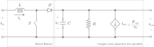
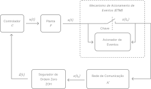

# Event-Based Control of DC-DC Converters Connected to Constant Power Loads

**Author:** Andevaldo da Encarnação Vitório <br>
**Advisor:** Iury Valente de Bessa <br>
**Course:** Bachelor's Degree in Computer Engineering <br>
**University:** Universidade Federal do Amazonas <br>
**Date of defense:** 02 de abril de 2024 <br>

## Project Description

This final course project deals with the development and implementation of event-based control for Buck and Boost DC-DC converters connected to Constant Power Loads (CPL). The main objective is to investigate and demonstrate the efficiency and effectiveness of event-based control techniques. To this end, various simulations and analyses were carried out using Python notebooks and specific simulation tools.

## Repository structure

The repository is organized into three main directories, each containing files relevant to different aspects of the project:

<<<<<<< HEAD
- **`simulator/`**: Contém a simulação de uma microrrede de corrente contínua.
- **`docs/`**: Contém as documentações do projeto.
  - _**Mathematical Modeling of a Microgrid**_: Detalhes da modelagem matemática da microrrede
=======
1. **/assets**: This directory contains the main images used in notebooks. The images are used to illustrate theoretical concepts, simulation results and converter performance graphs.
>>>>>>> development

2. **/notebooks**: This directory contains the Python notebooks that were used throughout the project. These notebooks contain the codes and their descriptions needed to carry out the simulations, as well as analysis and visualization of the data obtained.

3. **/simulations**: It contains the simulation files that were executed during the development of the project. These files include configuration scripts, simulation parameters and results obtained from the simulations.

<<<<<<< HEAD
Os modelos matemáticos obtidos neste documento são fundamentais para o desenvolvimento do simulador e a avaliação das estratégias de ETC (Controle Acionado por Evento) para microrredes de corrente contínua.
=======
## Conteúdo dos Diretórios

### /assets

- **buck-converter/circuit.svg**: Schematic diagram of the Buck converter.
- **boost-converter/circuit.svg**: Schematic diagram of the Boost converter.
- **etc-mode.png**: Schematic diagram of the ETC used in this project.

### /notebooks

- **dynamic-etm-van-der-pol-oscillator.ipynb**: Notebook with the simulation of the Van de Pol oscillator under the dynamic ETC.
- **static-etm-van-der-pol-oscillator.ipynb**: Notebook with the simulation of the Van de Pol oscillator under the static ETC.
- **etc-boost-converter-with-cpl.ipynb**: Notebook with Boost converter simulation under static and dynamic ETC.
- **etc-buck-converter-with-cpl.ipynb**: Notebook with Buck converter simulation under static and dynamic ETC.

## Description of the Converters

The Buck converter used in the simulator consists of a basic Buck converter with an RLC output voltage filter, as depicted in Figure 1. This converter supplies two loads: a Constant Resistance Load (CRL) and a Constant Power Load (CPL).

<p align="center">
	 
	<br>
	<strong>Figure 1:</strong> Buck converter circuit.
</p>

The Boost converter used is shown in Figure 2. This converter supplies two loads in parallel with a capacitor: a Constant Resistance Load (CRL) and a Constant Power Load (CPL).

<p align="center">
	 
	<br>
	<strong>Figure 2:</strong> Boost converter circuit.
</p>

## Event-Triggered Control Model for the Buck Converter

The control model for the Buck converter employs an Event-Triggered Mechanism (ETM) to optimize control actions while minimizing computational resources. The system comprises a plant $P$, representing the Buck converter, described by the state-space equation:

$$ \dot{x} = Ax(t) + Bu(t) $$

where $x(t) \in \mathbb{R}^n$ are the system states and $u(t) \in \mathbb{R}^m$ is the control input. The state feedback control law is given by:

$$ u(t) = K\hat{x}(t) $$

The ETM determines when to transmit the plant's state to the controller over a network, maintaining the state with a Zero-Order Hold (ZOH) until the next transmission, leading to a potential transmission error:

$$ e(t) = \hat{x}(t) - x(t), \quad \forall t \in [t_k, t_{k+1}) $$

<p align="center">
	 
	<br>
	<strong>Figure 3:</strong> Event-triggered Control Model
</p>

### ETM Models and Optimization

**Static Event-Triggered Mechanism**

The static ETM has a fixed activation function:

$$ t_{k+1} = \inf \{ t > t_k : \Gamma(x(t), e(t)) < 0 \} $$

where the triggering function is:

$$ \Gamma(x(t), e(t)) = x^T(t) \Psi x(t) - e^T(t)\Xi(t) $$

**Dynamic Event-Triggered Mechanism**

The dynamic ETM includes an internal dynamic variable:

$$ t_{k+1} = \inf \{t > t_k : \eta(t) + \theta \Gamma(x(t), e(t)) < 0 \} $$

with the internal variable dynamics:

$$ \dot{\eta} = -\lambda \eta(t) + \Gamma(x(t), e(t)) $$

**Optimization for ETM Design**

The optimization problem to determine the matrices $\Xi$, $\Psi$, and $K$ is formulated as:

$$
\underset{X, \tilde{\Xi}, \tilde{\Psi}, \tilde{K}}{\min} \quad \mathrm{tr}\left(\rho \tilde{\Xi} + (1 - \rho)\tilde{\Psi}\right)
$$
$$
\text{subject to} \quad 10^{-\mu} \mathrm{I} \leq \tilde{\Xi} \leq 10^{\mu} \mathrm{I}, \quad 10^{-\mu} \mathrm{I} \leq \tilde{\Psi} \leq 10^{\mu} \mathrm{I}
\hspace{0.5cm} \mathrm{e} \hspace{0.5cm}
\begin{bmatrix}
\mathsf{He}(AX + B\tilde{K}) & B\tilde{K}   & X             \\
\star                       & -\tilde{\Xi} & 0             \\
\star                       & \star        & -\tilde{\Psi}
\end{bmatrix} < 0
$$

The matrices are obtained as $K = \tilde{K}X^{-1}$, $\Xi = X^{-1}\tilde{\Xi}X^{-1}$, and $\Psi = \tilde{\Psi}^{-1}$.


## Running Instructions

To run the simulations and analyze the results, follow the steps below:

1. Clone the repository to your local machine:

   ```bash
   git clone git@github.com:andel-vitorio/etc-for-dc-converters.git
   ```

2. Navigate to the project directory:

   ```bash
   cd etc-for-dc-converters
   ```

3. Install the necessary dependencies:

   ```bash
   pip install -r requirements.txt
   ```

4. Open Jupyter Notebook:

   ```bash
   jupyter notebook
   ```

5. Navigate to the **/notebooks** directory and open the desired notebook to run the simulations and view the results.

## Contributions

Contributions to improve this project are welcome. To contribute, please follow the steps below:

1. Fork this repository.
2. Create a new branch for your changes:
   ```bash
   git checkout -b feature/new-feature
   ```
3. Commit your changes:
   ```bash
   git commit -m 'Add new feature'
   ```
4. Upload to the original repository:
   ```bash
   git push origin feature/new-feature
   ```
5. Open a Pull Request.

## License

This project is licensed under the MIT License. See the [LICENSE](LICENSE) file for more details.
>>>>>>> development
