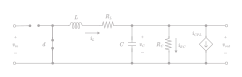

# Modelagem Matemática de uma Microrrede

## 1. Introdução

Neste guia, abordaremos a modelagem matemática de uma microrrede representada por um conversor buck com uma CPL, carga de potência constante. O conversor buck é um tipo de conversor de potência que converte tensão contínua de alta tensão para tensão contínua de baixa tensão. A CPL é um tipo de carga que requer uma potência constante, independentemente da tensão de entrada.

## 2. Descrição do Sistema e Circuito

O sistema a seguir foi projetado para simplificar a representação de uma microrrede, visando facilitar cálculos e análises. Composto por um conversor buck e uma CPL configurada como carga de potência constante, representada por uma fonte de corrente, o sistema oferece uma abordagem eficiente para modelar o comportamento da microrrede.

  

No circuito apresentado:

- $R_L, \space R_C, \space C, \space L$: Resistores, capacitor e indutor do circuito.
- $d$: Duty Cycle
- $I_{CPL}$: Corrente da CPL
- $V_{in}$: Tensão de entrada.
- $V_{out}$: Tensão de entrada.

## 3. Formulação das Equações do Circuito

As equações que descrevem o comportamento do sistema podem ser derivadas usando as leis fundamentais da eletricidade. O modelo matemático do conversor _buck_ adotado é fundamentado no modelo médio do sistema. Embora os conversores sejam intrinsecamente não-lineares, a prática comum consiste em empregar modelos de pequenos sinais (SSMs) para obter uma representação linearizada em torno do ponto operacional (OP). Para isso, consideraremos o circuito em duas situações: chave fechada e aberta.

### 3.1 Chave Fechada

Na situação em que a chave está fechada, o circuito é equivalente a um circuito série com uma fonte de tensão, um resistor e uma indutância.

  

As equações que descrevem esse circuito são as seguintes:

1. Lei de Kirchhoff das Tensões

$$ V_{in} - L \frac{d}{dt}i_L - R_L i_L - v_C = 0 $$
$$ L \frac{d}{dt}i_L = V_{in} - R_L i_L - v_C $$

$$ \frac{d}{dt}i_L =  \frac{1}{L} V_{in}  - \frac{R_L}{L} i_L - \frac{1}{L} v_C $$

2. Lei de Kirchhoff das Correntes

$$ i_L = i_C + I_{CPL} + I_{R_{C}} $$
$$ i_L = C \frac{d}{dt} v_C + \frac{P_{CPL}}{v_C} + \frac{v_C}{R_C} $$
$$ C \frac{d}{dt} v_C = i_L - \frac{v_C}{R_C} - \frac{P_{CPL}}{v_C} $$

$$ \frac{d}{dt} v_C = \frac{1}{C} i_L - \frac{1}{C R_C} v_C - \frac{1}{C v_C} P_{CPL} $$

Logo,

$$
\begin{equation}
M_{fechada}: \space
\tag{3.1} 
\begin{cases}
\frac{d}{dt}i_L &= \frac{R_L}{L} i_L - \frac{1}{L} v_C \\ \\
\frac{d}{dt} v_C &= \frac{1}{C} i_L - \frac{1}{C R_C} v_C - \frac{1}{C v_C} P_{CPL}
\end{cases}
\end{equation}
$$

### 3.2 Chave Aberta

Na situação em que a chave está aberta, o circuito é desconectado da fonte de tensão.

  

As equações que descrevem esse circuito são as seguintes:

1. Lei de Kirchhoff das Tensões

$$ L \frac{d}{dt}i_L + R_L i_L + v_C = 0 $$

$$
\frac{d}{dt}i_L = - \frac{R_L}{L} i_L - \frac{1}{L} v_C \\
$$

2. Lei de Kirchhoff das Correntes

$$ i_L = i_C + I_{CPL} + I_{R_{C}} $$
$$ i_L = C \frac{d}{dt} v_C + \frac{P_{CPL}}{v_C} + \frac{v_C}{R_C} $$
$$ C \frac{d}{dt} v_C = i_L - \frac{v_C}{R_C} - \frac{P_{CPL}}{v_C} $$

$$ \frac{d}{dt} v_C = \frac{1}{C} i_L - \frac{1}{C R_C} v_C - \frac{1}{C v_C} P_{CPL} $$

Logo,

$$
\begin{equation}
M_{aberta}: \space
\tag{3.2} 
\begin{cases}
\frac{d}{dt}i_L &= \frac{V_{in}}{L} d - \frac{R_L}{L} i_L - \frac{1}{L} v_C \\ \\
\frac{d}{dt} v_C &= \frac{1}{C} i_L - \frac{1}{C R_C} v_C - \frac{1}{C v_C} P_{CPL}
\end{cases}
\end{equation}
$$

### 3.3 Modelo Médio do Sistema

Baseado nas equações obtidas anteriormente, o modelo médio do sistema, representado pelas equações diferenciais abaixo, descreve o comportamento do circuito quando a chave está operando continuamente:

 

$$
\begin{equation}
MMS: \space
\tag{3.3} 
\begin{cases}
\frac{d}{dt}i_L &= \frac{V_{in}}{L} d - \frac{R_L}{L} i_L - \frac{1}{L} v_C \\ \\
\frac{d}{dt} v_C &= \frac{1}{C} i_L - \frac{1}{C R_C} v_C - \frac{1}{C v_C} P_{CPL}
\end{cases}
\end{equation}
$$

 

## 4. Modelo do Sistema Transladado

Ao adentrarmos no Modelo do Sistema Transladado, é importante primeiro definir as variáveis de estado e os valores de operação. Essas definições serão usadas para descrever o comportamento do sistema transladado.

Dada a condição de operação $P_O = \left( \overline{i_L}, \space \overline{V_C}, \space \overline{d}, \space \overline{P_{CPL}} \right) $, os estados e as entradas do sistema pode ser decompostos em termos fixos e em termos variantes no tempo.

 

$$
X: \space
\begin{cases}
  i_L(t) &= \overline{i_L} + \delta i_L(t) \\
  v_C(t) &= \overline{V_C} + \delta V_C(t) 
\end{cases}
, \space \space \space \space \space
U: \space
\begin{cases}
  d(t) &= \overline{d} + \delta d(t) \\
  P_{CPL}(t) &= \overline{P_{CPL}} + \delta P_{CPL}(t)
\end{cases}
$$

 

Além disto, as derivadas temporais das variáveis de estado também são representadas por:

 

$$
\dot{X}: \space
\begin{cases}
  \dot{i_L} &= \overline{\dot{i_L}} + \delta \dot{i_L} \\
  \dot{v_C} &= \overline{\dot{V_C}} + \delta \dot{V_C} 
\end{cases}
$$

 

Para a modelagem da dinâmica do sistema, são definidas as seguintes funções a partir da __Equação 3.3__:

$$
\begin{cases}
  f(i_L, \space v_C, \space d, \space P_{CPL}) = \dot{i_L} = - \frac{R_L}{L} i_L - \frac{1}{L} v_C + \frac{V_{in}}{L} d \\
  g(i_L, \space v_C, \space d, \space P_{CPL}) = \dot{v_C} = - \frac{1}{C R_C} v_C + \frac{1}{C} i_L - \frac{1}{C v_C} P_{CPL}
\end{cases}
$$

 

Importante notar que, sob condições de operação em regime permanente, as funções no ponto de operação são ambas nulas

$$ f(P_O) = g(P_O) = \overline{\dot{i_L}} = \overline{\dot{v_C}} = 0 $$

Baseado nisto, podemos obter as equações da corrente e tensão do sistema transladado.

### Equação da Corrente $i_L$

No ponto de operação, o valor de $f$ é nulo. Portanto,

$$
f(P_E) = - \frac{R_L}{L} \overline{i_L} - \frac{1}{L} \overline{v_C} + \frac{V_{in}}{L}  \overline{d} = 0
$$

$$ - R_L \overline{i_L} - \overline{v_C} + V_{in}  \overline{d} = 0 $$

$$ V_{in}  \overline{d} = R_L \overline{i_L} + \overline{v_C} $$

$$ 
\begin{equation}
\tag{4.1.1}
\overline{d} = \frac{R_L}{V_{in}} \overline{i_L} + \frac{\overline{v_C}}{V_{in}} 
\end{equation}
$$
 

Decompondo a equação $\dot{i_L}$ em termos fixos e em termos variantes no tempo, obtemos,

$$ \dot{i_L} = - \frac{R_L}{L} i_L - \frac{1}{L} v_C + \frac{V_{in}}{L} d $$

$$ \overline{\dot{i_L}} + \delta \dot{i_L} = - \frac{R_L}{L} \left(\overline{i_L} + \delta i_L\right) - \frac{1}{L} \left(\overline{v_C} + \delta v_C\right) + \frac{V_{in}}{L} \left(\overline{d} + \delta d\right) $$

$$ 
\begin{equation}
\tag{4.1.2}
\delta \dot{i_L} = - \frac{R_L}{L} \overline{i_L} - \frac{R_L}{L} \delta i_L - \frac{1}{L} \overline{v_C} - \frac{1}{L} \delta v_C + \frac{V_{in}}{L} \overline{d} + \frac{V_{in}}{L} \delta d 
\end{equation}
$$
 

Substituindo a __Equação 4.1.1__ em __Equação 4.1.2__, podemos obter a seguinte equação da corrente: 

$$
\delta \dot{i_L} = - \frac{R_L}{L} \overline{i_L} - \frac{R_L}{L} \delta i_L - \frac{1}{L} \overline{v_C} - \frac{1}{L} \delta v_C + \frac{V_{in}}{L} \left( \frac{R_L}{V_{in}} \overline{i_L} + \frac{\overline{v_C}}{V_{in}}\right) + \frac{V_{in}}{L} \delta d
$$

$$ \delta \dot{i_L} = - \frac{R_L}{L} \overline{i_L} - \frac{R_L}{L} \delta i_L - \frac{1}{L} \overline{v_C} - \frac{1}{L} \delta v_C +  \frac{R_L}{L} \overline{i_L} + \frac{1}{L} \overline{v_C} + \frac{V_{in}}{L} \delta d $$

$$ 
\begin{equation}
\tag{4.1.3}
\delta \dot{i_L} = - \frac{R_L}{L} \delta i_L - \frac{1}{L} \delta v_C  + \frac{V_{in}}{L} \delta d
\end{equation}
$$

### Equação da Tensão $v_C$

No ponto de operação, o valor de $g$ também é nulo. Portanto,

$$ g(P_E) = - \frac{1}{C R_C} \overline{v_C} + \frac{1}{C} \overline{i_L} - \frac{1}{C \overline{v_C}} \overline{P_{CPL}} = 0 $$

$$ - \frac{1}{R_C} \overline{v_C} + \overline{i_L} - \frac{1}{\overline{v_C}} \overline{P_{CPL}} = 0 $$

$$ 
\begin{equation}
\tag{4.2.1}
\overline{i_L} = \frac{1}{R_C} \overline{v_C} + \frac{1}{\overline{v_C}} \overline{P_{CPL}}
\end{equation}
$$
 

Decompondo a equação $\dot{v_C}$ em termos fixos e em termos variantes no tempo, obtemos,

$$ 
\dot v_C = - \frac{1}{C R_C} v_C + \frac{1}{C} i_L - \frac{1}{C v_C} P_{CPL} 
$$

$$ 
\overline{\dot{v_C}} + \delta \dot{v_C} = - \frac{1}{C R_C} \left(\overline{v_C} + \delta v_C\right) + \frac{1}{C} \left( \overline{i_L} + \delta i_L\right) - \frac{1}{C \left(\overline{v_C} + \delta v_C\right)} \left(\overline{P_{CPL}} + \delta P_{CPL}\right) 
$$

$$ 
\begin{equation}
\tag{4.2.2}
\delta \dot{v_C} = - \frac{1}{C R_C} \overline{v_C} - \frac{1}{C R_C} \delta v_C + \frac{1}{C} \overline{i_L} + \frac{1}{C}  \delta i_L - \frac{1}{C \left(\overline{v_C} + \delta v_C\right)} \left(\overline{P_{CPL}} + \delta P_{CPL}\right) 
\end{equation}
$$
 

Substituindo a __Equação 4.2.1__ em __Equação 4.2.2__, podemos obter a seguinte equação da tensão: 

$$ 
\delta \dot{v_C} = - \frac{1}{C R_C} \overline{v_C} - \frac{1}{C R_C} \delta v_C + \frac{1}{C} \left(\frac{1}{R_C} \overline{v_C} + \frac{1}{\overline{v_C}} \overline{P_{CPL}}\right) + \frac{1}{C}  \delta i_L - \frac{1}{C \left(\overline{v_C} + \delta v_C\right)} \left(\overline{P_{CPL}} + \delta P_{CPL}\right) 
$$

$$ 
\delta \dot{v_C} = - \frac{1}{C R_C} \delta v_C + \frac{1}{C \overline{v_C}} \overline{P_{CPL}} + \frac{1}{C}  \delta i_L - \frac{1}{C \left(\overline{v_C} + \delta v_C\right)} \left(\overline{P_{CPL}} + \delta P_{CPL}\right) 
$$

$$ 
\begin{equation}
\tag{4.2.3}
\delta \dot{v_C} = - \frac{1}{C R_C} \delta v_C  + \frac{1}{C}  \delta i_L + \frac{\overline{P_{CPL}} \delta v_C - \overline{v_C} \delta P_{CPL}}{C \overline{v_C} \left(\overline{v_C} + \delta v_C\right)} 
\end{equation}
$$
 

### Sistema Transladado

Portanto, o sistema transladado, considerando o ponto de operação $P_O = \left( \overline{i_L}, \space \overline{V_C}, \space \overline{d}, \space \overline{P_{CPL}} \right) $, é:

 

$$
\begin{equation}
M_{transladado}: \space
\tag{4.3} 
\begin{cases}
\delta \dot{i_L} &= - \displaystyle\frac{R_L}{L} \delta i_L - \displaystyle\frac{1}{L} \delta v_C  + \displaystyle\frac{V_{in}}{L} \delta d
\\ \\
\delta \dot{v_C} &= - \displaystyle\frac{1}{C R_C} \delta v_C  + \displaystyle\frac{1}{C}  \delta i_L + \displaystyle\frac{\overline{P_{CPL}} \delta v_C - \overline{v_C} \delta P_{CPL}}{C \overline{v_C} \left(\overline{v_C} + \delta v_C\right)} 
\end{cases}
\end{equation}
$$
 

## 5. Linearização do Sistema

A seguir é apresentado os parâmetros para a linearização do sistema:

### Tabela de estados, entradas, parâmetros, ponto de operação e saída

| **Categoria**         | **Nome**                             | **Definição**                                  |
| --------------------- | ------------------------------------ | ---------------------------------------------- |
| **Estados**           | Variação da corrente do indutor      | $\delta i_L(t) = i_L(t) - {i_L}_0$             |
|                       | Variação da tensão do capacitor      | $\delta v_C(t) = v_C(t) - {v_C}_0$             |
| **Entradas**          | Variação do duty cycle               | $\delta d(t) = d(t) - d_0$                     |
|                       | Variação da potência da carga        | $\delta P_{cpl}(t) = P_{cpl}(t) - {P_{cpl}}_0$ |
| **Parâmetros**        | Tensão de entrada                    | $V_{in}$                                       |
|                       | Resistência em série com o indutor   | $R_L$                                          |
|                       | Resistência em paralelo ao capacitor | $R_c$                                          |
|                       | Indutância                           | $L$                                            |
|                       | Capacitância                         | $C$                                            |
| **Ponto de operação** | Corrente do indutor                  | ${i_L}_0$                                      |
|                       | Tensão do capacitor                  | ${v_C}_0$                                      |
|                       | Duty cycle                           | ${d}_0$                                        |
|                       | Potência da carga                    | ${P_{cpl}}_0$                                  |
| **Saída**             | Variação da Tensão do Capacitor      | $y = \delta v_C$                               |

O sistema linearizado terá a forma:

$$
  \begin{cases}
    \frac{d}{dt} (\delta i_L) &= k_1 \cdot \delta i_L + k_2 \cdot \delta v_C + k_3 \cdot \delta d \\ \\
    \frac{d}{dt} (\delta v_C) &= k_4 \cdot \delta i_L + k_5 \cdot \delta v_C + k_6 \cdot \delta P_{CPL}
  \end{cases}
$$

Considerando as seguinte relações:

$$P_f = (i_L, v_C, d), \space\space {P_f}_0 = ({i_L}_0, {v_C}_0, d_0)$$  
$$P_g = (i_L, v_C, P_{CPL}), \space\space   {P_g}_0 = ({i_L}_0, {v_C}_0, {P_{CPL}}_0)$$  
$$f(P_f) = \frac{d}{dt}i_L, \space\space  g(P_g) = \frac{d}{dt}v_C$$

Podemos obter as constante:

$$
k_1 = \dfrac{\partial f}{\partial i_L} \vert _{P_f = {P_f}_0}, \space \space
k_2 = \dfrac{\partial f}{\partial v_C} \vert _{P_f = {P_f}_0}, \space \space
k_3 = \dfrac{\partial f}{\partial d} \vert _{P_f = {P_f}_0}
$$

$$
k_4 = \dfrac{\partial g}{\partial i_L} \vert _{P_g = {P_g}_0}, \space \space
k_5 = \dfrac{\partial g}{\partial v_C} \vert _{P_g = {P_g}_0}, \space \space
k_6 = \dfrac{\partial g}{\partial P_{CPL}} \vert _{P_g = {P_g}_0}
$$

Desta forma, os termos são:

$$
k_1 = - \frac{R_L}{L}, \space\space
k_2 = - \frac{1}{L}, \space\space
k_3 = \frac{V_{in}}{L}
$$

$$
k_4 = \frac{1}{C}, \space\space
k_5 = \frac{1}{C}\left(\frac{{P_{CPL}}_0}{{{{v_{C}}_0}^2}} - \frac{1}{R_C}\right), \space\space
k_6 = - \frac{1}{C {v_C}_0}
$$

Portanto, o sistema linearizado é:

$$
  \begin{cases}
    \frac{d}{dt} (\delta i_L) &= - \frac{R_L}{L} \delta i_L - \frac{1}{L} \delta v_C + \frac{V_{in}}{L} \delta d \\ \\
    \frac{d}{dt} (\delta v_C) &= \frac{1}{C} \delta i_L + \frac{1}{C}\left(\frac{{P_{CPL}}_0}{{{{v_{C}}_0}^2}} - \frac{1}{R_C}\right) \delta v_C - \frac{1}{C {v_C}_0} \delta P_{CPL}
  \end{cases}
$$
